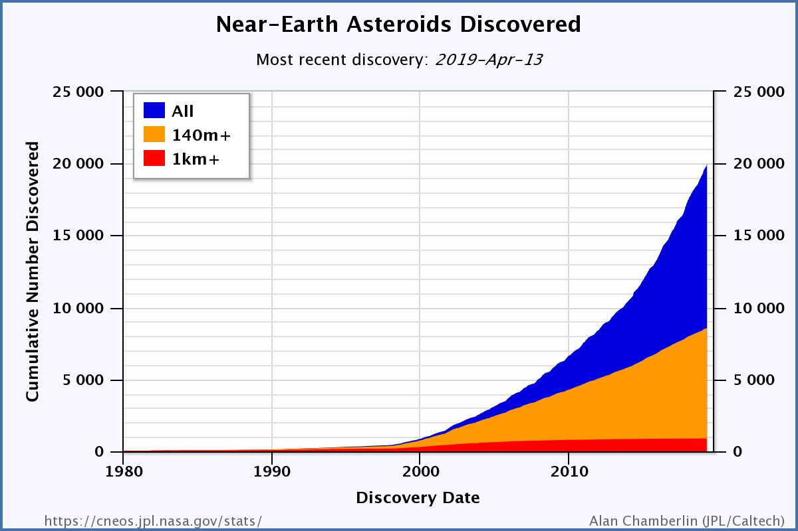
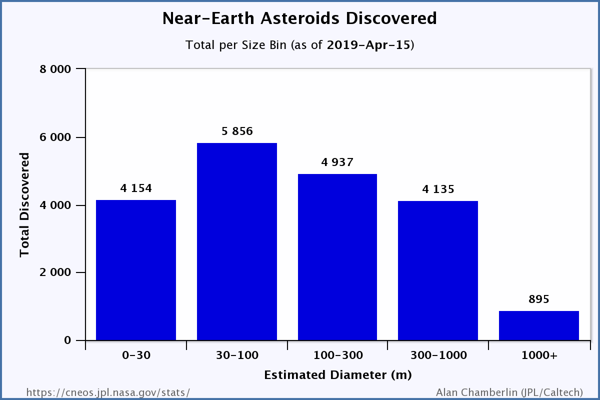

```{r  message=FALSE, echo=FALSE}
library(dplyr)
library(tidyr)
library(ggplot2)
asteroids_clean <- read.csv("asteroids_clean.csv")
head(asteroids_clean)

```

# NEO Earth Close Approaches 

As they orbit the Sun, Near-Earth Objects occasionally approach close to Earth. CNEOS calculates the motion of all NEOs forwards to 2200 A.D. and backwards to 1900 A.D., and determines the times and distances of the Earth close approaches. The results are tabulated [here](https://cneos.jpl.nasa.gov/ca/). You can customize the contents and organization of the table via the Table Settings pulldown lists.

## Including Plots

```{r message=FALSE, echo=FALSE}
#asteroids_clean<-asteroids_clean[1:10000,]
ggplot(asteroids_clean, aes(x = Date, y = Diam_min)) + geom_point()
```

##Result shows clear in the middle one kind of anomaly.

In this plot we can see missing appoaches in the middle. What this mean less activity or missing data. We know from 2005 we started to search more intense for asteroids



